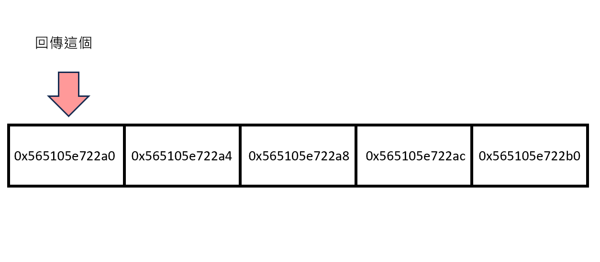

# 更多指標

這個章節將介紹更多有關指標相關的語法及技巧。

## 基於指標的陣列

在字串章節當中也提到因為陣列本身就代表一個位址，因此：

```c=
scanf("%s", str);
```

我們的 `str` 前方不需要再加上 `&` 去取得 `str` 的位址，
而在這裡，我們將要介紹如何用指標實作陣列：

```c=
#include <stdio.h>

int main() {
    int arr[10], n = 10;
    int *p = arr;
    for(int i=0; i<n; i++) {
        scanf("%d", (p+i));
    }
    for(int i=0; i<n; i++) {
        printf("%d ", *(p+i));
    }
    printf("\n");
    return 0;
}
```

首先，`arr` 本身就是一個指標，而他的 value 則存著這個陣列的第一個位址，
因此，`*p = arr` 則代表將 `arr` 的位址賦值給了 `p`，換個角度來看，
也可以說是 `p` 指向了 `arr`，因此改 `p`，`arr` 會被動；改 `arr`，`p` 也會被動，
牽一髮動全身，因為他們都指向同一個位址。

### 延伸思考

透過上述觀察可以發現，其實 `p[i]` 和 `*(p+i)` 是等價的，
更直接地說，`[]` 的寫法就是一種語法糖，而接著推論，
可以得到 `*(i+p)` 等價於 `*(p+i)` 的結論，
這也就是說，我們甚至能夠這樣「玩弄」陣列：

```c=
#include <stdio.h>

int main() {
    int arr[5] = {3, 6, 1, 5, -2};
    printf("%d\n", 3[arr]);
    return 0;
}
```

## 動態記憶體配置 malloc

`malloc()` 全名是 memory allocation，又叫做動態記憶體配置，
能夠向程式動態索取記憶體：

```c=
malloc(memory_size * type_size);
```

首先傳入要配置的記憶體數量，接著乘上每個記憶體占用的位元數，
，而 `malloc()` 會回傳這段記憶體的第一個位址，如附圖：

```c=
malloc(5 * sizeof(int));
```



而通常我們看到的，在 `malloc()` 前都還會加上一個指標變數的型別轉換，比如說：

```c=
int *arr = (int*)malloc(N * sizeof(int));
```

會需要這麼做的原因是，因為 `malloc()` 雖然會回傳一個位址，
但這個位址是 `void*` 型別的，`void*` 的意義大概可理解成，
「目前不確定是什麼型別，但之後不管我丟什麼你都要可以處理」，
而在上述範例程式碼中我們需要的是 `int*` 型別，
因此我們會在前方加上 `(int*)` 來將這個位址轉換成 `int*` 型別。

由此延伸，通常型別轉換 (type casting) 是相對不安全的，
而這個問題也在 C++ 中有了改善，相對於 `malloc()`，
在 C++ 中我們更偏好基於物件的概念透過 `new` 關鍵字建立物件：

```cpp=
int *arr = new int[N];
```

而這也讓我們再次反思在指標允許我們直接訪問並修改記憶體時，
所帶來的風險及缺點。

## 快速排序 qsort

`qsort()` 的全名是 quick sort，是 C 內建的函式，
存在於 `<stdlib.h>` 這個函式庫中，其功能如同字面意義，
就是排序：

```c=
qsort(void *base, size_t nitems, size_t size, int (*compar)(const void *, const void*))
```

簡單來說，第一個參數是你要排序的資料的起始位置，
第二個是你要從這個起始位置往後 `nitems` 個位置，
第三是你要排序的資料的單位資料位元大小，
第四則是要自己定義的 `compare()` 函式，
也就是要自己另外宣告函式去定義排序的規則，
順帶一提，C++ 的 `compare()` 支援 $Lambda$ 表示式。

```c=
#include <stdio.h>
#include <stdlib.h>
#define N 10005

int compare(const void* a, const void* b) {
    int x = *(int*)a;
    int y = *(int*)b;
    return x - y;
}

int main() {
    int arr[] = {6, 3, 2, 10, 8};
    qsort(arr, 5, sizeof(int), compare);
    for(int i=0; i < 5; i++) {
        printf("%d ", *(arr+i));
    }
    printf("\n");
    return 0;
}
```

那我想這邊大家最困惑的肯定得是 `compare()` 的部分，
所以我們一個一個拿出來看：

### const void\* a

首先，const 代表著該資料除了宣告和第一次給值以外都不能被修改：

```c=
#include <stdio.h>

const double PI = 3.14;

int main() {
    PI = -1;
    return 0;
}
```

大家可以試著去執行這段 code，會發現他沒辦法編譯，
而我們之所以會需要 `const` 的主要原因就是希望這個值不要被修改，
就像圓周率是不會有變動的值，我們就會將它宣告成常數。

而在 `qsort()` 中我們的目標是對資料做排序，過程並不會更改值的內容，
因此我們所傳入的值便會將他宣告成常數以防我們不小心更改到。

接著是 `void*` 的部分，剛才有提到 `void*` 能夠接受任何型別，
而這邊會這麼使用則是因為我們不確定我們所要排序的資料的型別，
但如果我們能夠保證型別，或是保證自己不會去修改到資料內容，
我們甚至也可以這樣寫：

```c=
int qsort(int* a, int* b) {
    int x = *a;
    int y = *b;
    return x - y;
}
```

### int x = \*(int\*)a

在使用 `const void*` 的寫法時，首先我們會需要使用型別轉換，
將 `void*` 型別的參數轉換成 `int*` 型別的，而接著，
在使用取值運算子 `*` 來取得我們真正想取得資料內容，
而非這個看了就令人頭痛的記憶體位址。

### return x - y

這個部分和字串比較函式 `strcmp()` 類似，
首先，這個回傳的目的是要判斷排序的兩個資料是否要交換，
而 $x$ - $y$ 如果等於 $0$ 那其實換或不換都是一樣的，
那其實從上述範例程式碼中應該也不難推出，
如果 $x$ - $y$ 的值如果大於零就代表 $x$ > $y$，
所以要交換，而 $x$ <= $y$ 則不需要。

#### 張胖練功坊 - 2D 點排序

https://hackmd.io/@Ateto/rkhcO9gSa

## 結構的指標

這邊要介紹的是對於結構指標的操作，可以先看這段程式碼：

```c=
#include <stdio.h>
#include <string.h>
#define N 10005

struct Employee {
    char name[N];
    int id;
    int salary;
} employee;

int main() {
    struct Employee *ptr = &employee;

}
```

如果我們今天想修改 `Employee` 的內容，依據之前對於指標的介紹，
應該會是這樣寫：

```c=
strcpy(*ptr.name, "Jack");
*ptr.id = 123;
*ptr.salary = 100000;
```

執行結果：

```
13:17: error: request for member 'name' in 'ptr', which is of pointer type 'Employee*' (maybe you meant to use '->' ?)
   13 |     strcpy(*ptr.name, "Jack");
      |                 ^~~~
C:/Users/tony/AppData/Local/Temp/CP Editor-dLbtCI/sol.cpp:14:10: error: request for member 'id' in 'ptr', which is of pointer type 'Employee*' (maybe you meant to use '->' ?)
   14 |     *ptr.id = 123;
      |          ^~
C:/Users/tony/AppData/Local/Temp/CP Editor-dLbtCI/sol.cpp:15:10: error: request for member 'salary' in 'ptr', which is of pointer type 'Employee*' (maybe you meant to use '->' ?)
   15 |     *ptr.salary = 100000;
      |          ^~~~~~
]
```

是的沒錯，這樣寫編譯會錯誤，原因是 `*ptr.id` 的這種寫法，
等價於 `*(ptr.id)`，也就是說你其實是對 `id` 取值，
但問題來了，`id` 根本不是指標，`ptr` 才是，這個問題用 `()`，
改變運算優先順序即可解決：

```c=
strcpy((*ptr).name, "Jack");
(*ptr).id = 123;
(*ptr).salary = 100000;
```

但你會發現這樣的寫法，一來寫起來很麻煩，二來可讀性並不怎麼好，
為此我們有了這樣的寫法：

```c=
strcpy(ptr->name, "Jack");
ptr->id = 123;
ptr->salary = 100000;
```

透過 `->` 來取的該結構指標取值後的成員，
而接著我們可以練習閱讀以下程式碼：

```c=
#include <stdio.h>
#include <stdlib.h>
#define N 100005

struct Employee {
    char name[N];
    int id;
    int salary;
};

int main() {
    struct Employee *employee;
    int n;

    scanf("%d", &n);
    employee = (struct Employee*)malloc(n * sizeof(struct Employee));

    for(int i=0; i < n; i++) {
        scanf("%s%d%d",
                (employee+i)->name,
                &(employee+i)->id,
                &(employee+i)->salary
                );
    }
    for(int i=0; i < n; i++) {
        printf("[name: %s, id: %d, salary: %d]\n",
                (employee+i)->name,
                (employee+i)->id,
                (employee+i)->salary
                );
    }
    return 0;
}
```

## 基於指標的二維陣列

這個章節最一開始介紹的是基於指標宣告的一維陣列，
而這邊將要介紹二維陣列的處理：

```c=
#include <stdio.h>
#include <stdlib.h>

int main() {
    int n, m;
    scanf("%d%d", &n, &m);

    int **arr = (int**)malloc(n * sizeof(int*));
    for(int i=0; i<n; i++) {
        *(arr+i) = (int*)malloc(m * sizeof(int));
    }

    for(int i=0; i<n; i++) {
        for(int j=0; j<m; j++) {
            scanf("%d", &arr[i][j]);
        }
    }

    for(int i=0; i<n; i++) {
        printf("%d", arr[i][0]);
        for(int j=1; j<m; j++) {
            printf(",%d", arr[i][j]);
        }
        printf("\n");
    }

    return 0;
}
```

上述程式碼可以建立出一個 $n*m$ 的二維陣列，
而透過觀察可以得知其實我們一開始只有宣告一個長度為 $n$ 的二維陣列，
而這 $n$ 個陣列個別的長度則是另外開了一個迴圈一個一個去指定的，
也因此，不難推論出的則是其實這 $n$ 個陣列的長度都是可變的，
所以不會像用 `[][]` 宣告二維陣列一樣，第二維的長度會是固定的。

### typedef

從上述程式碼中你會發現 `int**` 的可讀性真的不是很好，
因此我們使用 `typedef` 來增加程式碼的可讀性：

```c=
#include <stdio.h>
#include <stdlib.h>

typedef int* T;

int main() {
    int n, m;
    scanf("%d%d", &n, &m);
    T *arr = (T*)malloc(n * sizeof(T));
    for(int i=0; i<n; i++) {
        *(arr+i) = (int*)malloc(m * sizeof(int));
    }
    for(int i=0; i<n; i++) {
        for(int j=0; j<m; j++) {
            scanf("%d", &arr[i][j]);
        }
    }
    for(int i=0; i<n; i++) {
        printf("%d", arr[i][0]);
        for(int j=1; j<m; j++) {
            printf(",%d", arr[i][j]);
        }
        printf("\n");
    }
}
```

使用 `typedef` 關鍵字將 `int*` 定義成 `T`。

## Memory Leak

當我們透過 `malloc()` 向程式分配動態記憶體，這段記憶體將會一直存在，
而當你已經不需要使用到這塊記憶體後卻沒有將他歸還給系統，
這個情況我們將它稱為 **Memory Leak**。

Memory Leak 在累積到一定程度後將會超過系統能提供的上限，然後當掉，
解決方法即在當一塊記憶體不需要使用過後使用 `free()` 將他歸還給系統：

```c=
#include <stdio.h>
#include <stdlib.h>
#define N 100005

int main() {
    int *arr = (int*)malloc(N*sizeof(int));
    int n;
    scanf("%d", &n);
    for(int i=0; i<n; i++) {
        scanf("%d", arr+i);
    }
    for(int i=0; i<n; i++) {
        printf("%d, ", *(arr+i));
    }
    free(arr); // 將 arr 記憶體歸還給系統
    return 0;
}
```

## 函數的指標

其實我們在 `qsort()` 的 `compare()` 中就可以觀察出，
其實函式本身也可以是一個指標，以打籃球為例，
我的全域有 `pass()` 和 `shoot()` 兩個函式，
而 `main()` 裡面還有一個 `display` 的函式指標。

而首先我先是將 `display()` 指向 `pass()`，再指向 `shoot()`，
透過這樣的技巧，我們只需要呼叫 `display()` 即可。

```c=
#include <stdio.h>
#include <stdlib.h>
#define N 100005

void pass(char name[]) {
    printf("%s pass!\n", name);
}

void shoot(char name[]) {
    printf("%s shoot!\n", name);
}

int main() {
    char player[N];
    void (*display)(char name[]);

    display = pass; // display() 指向 pass()
    scanf("%s", player);
    display(player);

    display = shoot; // display() 指向 shoot()
    scanf("%s", player);
    display(player);

    return 0;
}
```

函式指標宣告的參數其實只要給型別即可：

```c=
void (*display)(char*); // char name[] 可視為 char*
```
